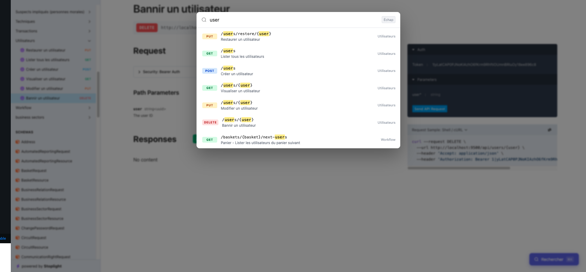
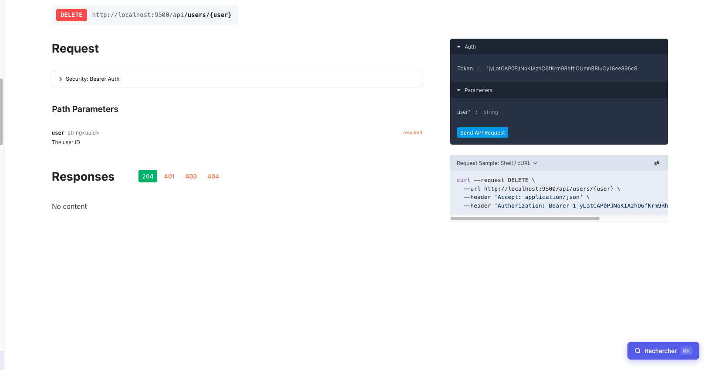

# Scramble Search Palette

A keyboard-driven route search palette for [Scramble](https://scramble.dedoc.co) API documentation.

Adds a `Ctrl+K` / `Cmd+K` shortcut that opens an instant search overlay to find and navigate to any API route — without touching Scramble's source code.

---

## Features

- **Instant search** across route path, HTTP method, summary and tag
- **Keyboard navigation** — `↑` `↓` to move, `Enter` to navigate, `Esc` to close
- **Color-coded method badges** — GET, POST, PUT, PATCH, DELETE
- **Term highlighting** in results
- **Dark mode** compatible
- **Zero dependencies** — vanilla JS + CSS injected into Scramble's view
- **No extra HTTP request** — reads the spec already embedded in the page

---

## Requirements

- PHP `^8.2`
- Laravel `^10|^11`
- `dedoc/scramble` (any version)

---

## Installation

```bash
composer require maestrodimateo/scramble-search
```

The service provider is auto-discovered by Laravel. No further configuration needed.

> **Note:** Do not publish Scramble's views (`vendor:publish --tag=scramble-views`).
> If you already have a published view at `resources/views/vendor/scramble/docs.blade.php`,
> remove it — this package provides its own.

---

## Preview





---

## Usage

Open your Scramble documentation (default: `/docs/api`) and:

| Action | Result |
|---|---|
| `Ctrl+K` / `Cmd+K` | Open the search palette |
| Type anything | Filter by path, method, summary or tag |
| `↑` / `↓` | Navigate results |
| `Enter` | Jump to the selected route |
| `Esc` or click outside | Close the palette |

A floating **Search** button is also available in the bottom-right corner.

---

## How it works

`ScrambleSearchServiceProvider` prepends its `resources/views` directory to the `scramble` view namespace after all providers have booted. This means Laravel resolves `scramble::docs` from this package instead of Scramble's default, without modifying any vendor file.

The view is identical to Scramble's default (`docs.blade.php`) with two additions:

1. **CSS** — styles for the overlay, search box, result items and the trigger button
2. **JS** — reads `spec.paths` already injected by Scramble (`@json($spec)`), builds the route list and handles all interactions

---

## License

MIT